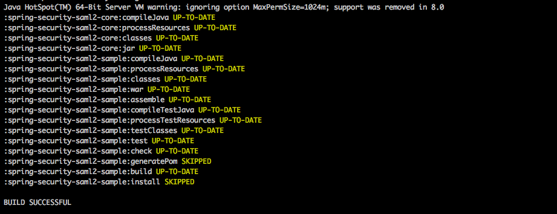
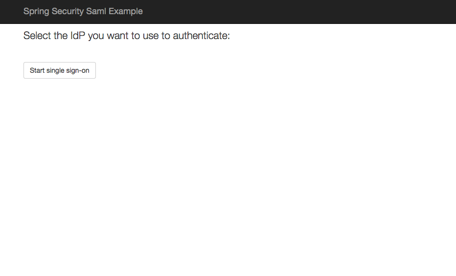
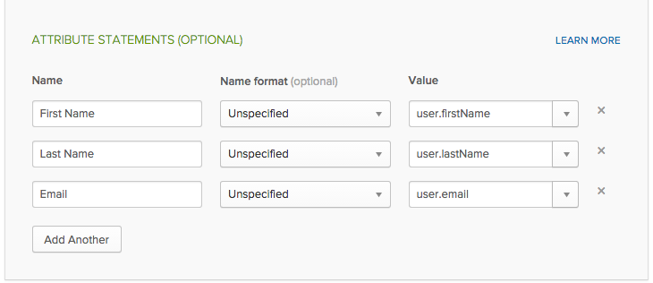
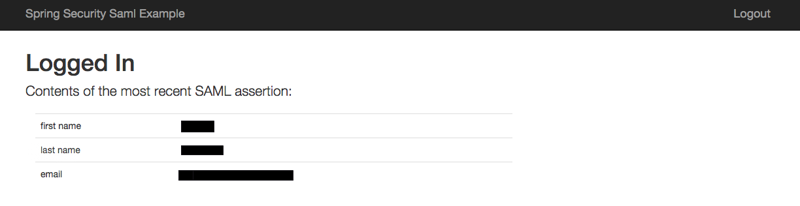
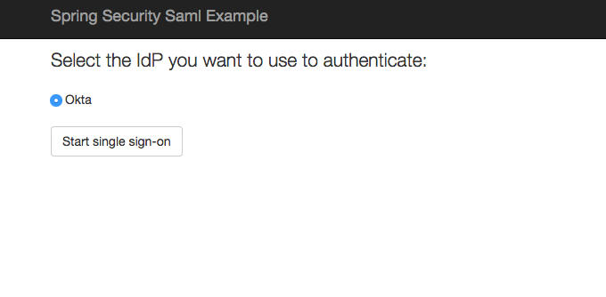
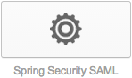

# Introduction 

This guide describes how to use Spring Security SAML to add support for Okta (via SAML) to Java applications that use the Spring framework.

In this guide, you will learn how to install and configure an Okta SAML application 

This guide assumes that you are familiar with the basics of Java software development: editing text files, using the command line, and running Tomcat, Maven or Gradle.

If you’re already familiar with Okta and Spring, you can skip to the section titled “Configuring Spring Security SAML to work with Okta”.


# Requirement 

Please make sure the following are installed before starting installation:

[Java 1.6+ SDK](http://www.oracle.com/technetwork/java/javase/overview/index.html)
	- Check using the command below 
	
	java -version


[Apache Maven](https://maven.apache.org/download.cgi)
	- Check using the command  below
	
	mvn --version


# Installation Setup

This section covers what you need to do to install and configure Tomcat from scratch on Mac OS X. If you already have Tomcat on your system, you can skip to Step 2 below.

How to install the Spring Security SAML sample Okta application on Mac OS X:

1. **Installing Tomcat** 
	- If it’s not already installed, install Tomcat with Homebrew using these directions: http://blog.bolshchikov.net/post/50277857673/installing-tomcat-on-macos-with-homebrew


2. **Downloading the Spring SAML Extension**

	- Use 'git clone' to clone the extention locally the repository locally

	```script 
	git clone https://github.com/spring-projects/spring-security-saml.git
	```


3. **Downloading sample application**
	
	- Use 'git clone' to clone this repository locally
	
	```script 
	git clone https://github.com/nshobayo/okta-SpringSAML.git
	```

	- Use the command below to copy the sample Okta application into the Extension's "src" folder
	
	```shell
	rm -rf spring-security-saml/sample/src/main
	cp -r okta-SpringSAML/src/main spring-security-saml/sample/src
	```

4. **Compilation**
	
	- Make sure your working directory is the `sample` subdirectory of the `spring-security-saml` directory 
	
	```script 
	cd spring-security-saml/sample
	```

	- To compile 
	
	```shell
	../gradlew build install
	``` 
	This task compiles, tests, and assembles the code into a `.war` file.
	
	A succesful build should look something like this 
	


	- Your compiled war archive file, `spring-security-SAML2-sample.war`, can be found in directory `build/libs/`


5. **Deployment**
	
	- Assuming your current directory is `spring-security-saml/sample` Use the command below to copy the compiled `spring-security-SAML2-sample.war` file to the Tomcat directory you set up in step one
	
	```shell
	cp build/libs/spring-security-SAML2-sample.war /Library/Tomcat/webapps/
	```


6. **Starting Tomcat**
	
	- Use the command below to start Tomcat
	
	```shell	
	/Library/Tomcat/bin/startup.sh
	```

	
7. **Starting Application**
	- Load the Spring SAML application by opening this Link: [Sample App](http://localhost:8080/spring-security-saml2-sample/saml/discovery?entityID=http%3A%2F%2Flocalhost%3A8080%2Fspring-security-saml2-sample%2Fsaml%2Fmetadata&returnIDParam=idp)
	- **Note** :Links on app will not be functional as of yet because we have not yet configured any IDPs.
	
	Here's what it should look like:

	


# Configuring Okta to work with Spring Security SAML

1.	Follow the directions under the "Configuring Okta to work with Spring Security SAML" at
	: http://developer.okta.com/docs/guides/spring_security_saml.html#configuring-okta-to-work-with-spring-security-SAML

	- ** STEP 7.a ** Attributes of the user to be sent in each SAML assertion can be added under "Attribute Statements" during this step if desired. Theses attribute values can be derived and used from the SP side.

	
	- Example of the attributes First Name, Last Name and Email being added can be found below:
	


# Configuring Spring Security SAML to work with Okta

1.	 Follow the directions under the "Configuring Spring Security SAML to work with Okta" at
	: http://developer.okta.com/docs/guides/spring_security_saml.html#configuring-spring-security-SAML-to-work-with-okta 


#Testing

Now that you’ve set up an application in Okta and configured the Spring Security SAML example application to use that application, you’re ready to test it out.

There are two ways to test a SAML application: Starting from the Spring application (“SP initiated”) and starting from Okta (“IdP initiated”). You will be testing both methods. In both cases, you will know of the test worked when you see a screen that looks like the one below:




1. **Login from the Spring Security SAML sample application (This is known as an “SP initiated” login)**

 - Open the sample application in your browser: http://localhost:8080/spring-security-saml2-sample
 - Select Okta 
 - Click the “Start single sign-on” button.


2. **Login from Okta (This is known as an “IdP initiated” login)**
	- Log in to your Okta organization

	- Click the button for the application you created in the “Configuring Okta to work with Spring Security SAML” section above: Spring Security SAML

	


If you’re able to get to the “Authenticated User” page using both of the methods above, then you’re done.

Congratulations on getting Okta working with Spring!
